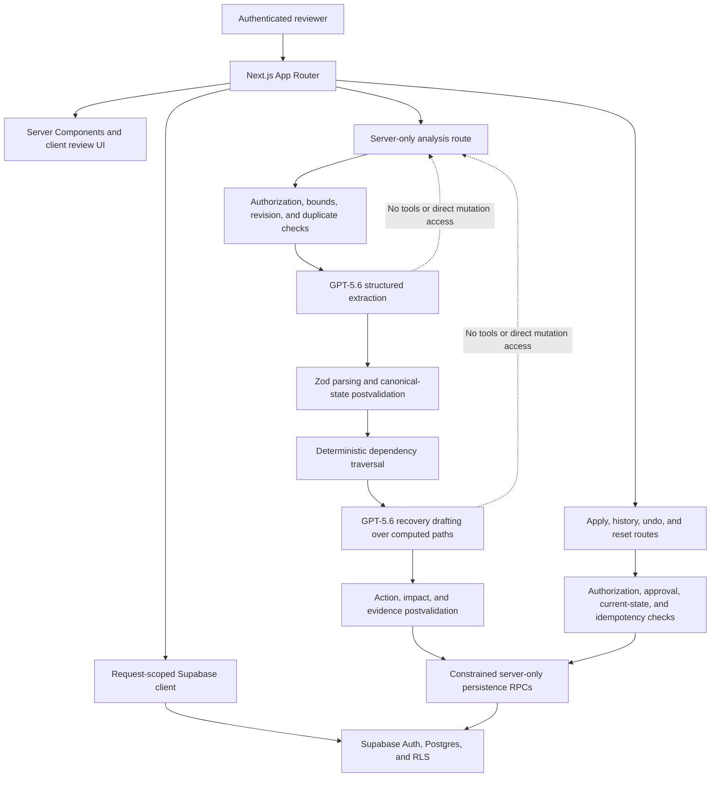

# InOrdo

**InOrdo turns one project update into evidence-backed impacts and recovery actions for selective human approval, with traceable history and undo contracts where supported.**

InOrdo is a Build Week project in the **Work and Productivity** track. It is designed for small teams that need to understand what a new fact changes before they update the rest of a project.

## Current status

The integrated P0 includes the workspace-scoped Supabase schema and synthetic summit fixture, email/password authentication, protected project records, deterministic dependency traversal, server-only GPT-5.6 analysis, selective approval, ordered audit history, compensating undo, and the named-demo reset workflow. A guarded Chromium journey verifies the real UI and public request contracts with provider/database seams intercepted; the authenticated live Supabase/OpenAI production smoke remains a release gate.

## Problem

A venue change, deadline shift, or revised decision rarely affects one record. It can invalidate tasks, milestones, risks, and shared artifacts several steps downstream. Small teams often reconstruct that chain manually, which leads to hidden blockers, stale plans, missed deadlines, and decisions that are hard to trace later.

## What InOrdo does

InOrdo keeps the response to change inside one reviewable sequence:

**evidence → impact → proposal → approval → history and undo**

- Preserves a pasted source update as evidence.
- Uses server-side GPT-5.6 to extract one bounded candidate change and draft recovery actions.
- Traverses explicit project dependencies with deterministic TypeScript logic.
- Shows direct and downstream impacts with readable paths.
- Keeps every proposed action inert until an authorized person selects it.
- Records applied internal operations and creates a compensating undo operation where the complete operation is reversible.
- Provides a constrained reset API for the named synthetic demo workspace.

The repository contains a public landing page, email/password sign-in, and a protected workspace under `/app`, including item, decision, risk, and dependency views. The workspace reads the seeded Supabase project, accepts source updates, renders persisted impact-review data, presents recovery actions, exposes the named-demo reset control to authorized roles, and reads operation history. The current integration limits are listed under [Known limitations](#known-limitations); this README does not claim a verified live model or production browser run.

## Core demo flow

The seed creates the **Civic Futures Lab — Regional Climate Action Summit 2026** synthetic workspace and project. All people, records, and updates are fictional. This is the intended recorded flow; use it in the submission only after each step passes the final QA gate.

1. Sign in with an operator-provisioned demo account and open `/app`.
2. Insert or paste the venue update that moves the summit from 12 September 2026 to 26 September 2026.
3. Submit the evidence to the server-only analysis route.
4. Review the preserved source beside GPT-5.6's structured candidate change.
5. Inspect direct and indirect impacts produced by deterministic dependency traversal, including the event → speaker confirmation → programme lock → briefing pack path.
6. Review recovery actions individually and, if the draft contains a travel-related action, leave it unselected because it needs a human cost decision.
7. Apply selected actions only when the proposal is in a backend-accepted state, then inspect actor-attributed history.
8. Undo an entirely reversible field-update operation, or reset the isolated demo through its server-held reset boundary.

Successful analysis finalization promotes only an eligible, fully linked proposal from `draft` to `ready`. That transition does not approve or apply anything: every recovery action remains pending and unattributed until an authorized owner or admin explicitly selects it. The UI continues to disable approval for every non-ready state.

## Screenshots and short GIFs

These captures come from the optimized production build served locally. They show product framing, not a live model response or an authenticated production session.


The protected workspace still needs a final capture after authenticated production QA. Do not use the removed fixture-preview route as submission evidence or describe a fixture as a live GPT-5.6 response.

## Architecture



The browser receives only the public Supabase URL and anonymous key. OpenAI and service-role credentials remain server-only. See [`docs/architecture.md`](docs/architecture.md) and [`docs/security-review.md`](docs/security-review.md) for the complete boundaries and threat review.

## Technology stack

| Layer | Technology |
| --- | --- |
| Web | Next.js 16 App Router, React 19, TypeScript |
| Styling | Tailwind CSS 4, Lucide icons |
| Data and identity | Supabase Postgres, Auth, RLS, Supabase JS/SSR |
| Model boundary | OpenAI Responses API, GPT-5.6, OpenAI SDK |
| Validation | Zod |
| Tests | Vitest, Testing Library, guarded Playwright journey, SQL assertion suites |
| Toolchain | Node.js 22, npm |

## How GPT-5.6 is meaningfully used

The analysis pipeline makes two bounded logical model calls on the server:

1. **Extraction:** GPT-5.6 receives the untrusted source and a bounded canonical project snapshot, then returns either one structured candidate change or no change.
2. **Recovery drafting:** after application validation and deterministic graph traversal, GPT-5.6 receives the validated change plus the computed impact paths and drafts one to eight inert recovery actions and impact annotations.

Both calls use strict Zod-backed structured output, no tools, `store: false`, bounded prompts and output, and postvalidation against canonical IDs, fields, values, versions, evidence spans, dates, owners, and impact coverage. An invalid candidate cannot drive traversal, and no derived records are persisted unless the complete pipeline validates.

This integration is implemented and covered by injected-adapter tests. A funded live OpenAI request has **not** yet been run from this worktree, so provider behavior is still a release gate rather than a submission claim.

## Model logic versus deterministic application logic

| GPT-5.6 may | Deterministic application code owns |
| --- | --- |
| Extract one candidate field change from supplied evidence. | Authentication, tenant authorization, and RLS-scoped access. |
| Quote evidence and surface confidence, ambiguity, and warnings. | Request limits, canonical-value checks, schemas, and fail-closed validation. |
| Draft bounded recovery actions from validated context. | Explicit dependency traversal, cycle handling, shortest paths, and maximum depth. |
| Annotate application-computed impacts with severity and explanations. | Project revisions, source hashes, fixed claim leases, duplicate reconciliation, rate limits, and idempotency. |
| Return structured data to the server-only adapter. | Proposal state, human approval, mutations, ordered history, undo, and demo reset. |

The model has no tools and no direct database path. It does not choose graph reach, authorize a user, approve an action, or mutate a project record.

## Human approval and undo safety

- A generated proposal is inert; model output never grants permission.
- Owner/admin authorization and current project state are rechecked before the privileged operation executor is initialized.
- Reviewers submit explicit action IDs and any required human responses. Unselected actions remain pending.
- Only allowlisted field updates, constrained task/risk creation, and confirmation activity can execute.
- Selected actions, mutations, proposal transitions, and ordered before/after audit records commit in one transaction or none do.
- An undo is a new compensating operation linked to the original; history is not erased.
- Undo is available only when every mutating action in the original operation is a reversible field update and current state still matches the recorded after-state.
- Demo reset is restricted to an owner/admin and the configured synthetic project; its secret never enters the browser request.

The database operation contracts have passed rollback-wrapped linked verification. Authenticated HTTP and production-browser verification remain pending.

## How Codex accelerated the build

The significant work sessions are summarized without private transcripts in [`docs/codex-log.md`](docs/codex-log.md). Codex helped the team deliver focused work packages while preserving Andres/Deston ownership boundaries:

- bootstrapped the Node 22/Next.js testable foundation and product documentation;
- designed and checked the workspace schema, RLS rules, synthetic seed, and SQL verification;
- implemented and tested authentication, bounded repositories, project records, and explicit dependency semantics;
- built the server-only structured-analysis boundary and adversarial validation cases;
- implemented deterministic traversal, selective operation contracts, append-only history, compensating undo, and reset safety;
- built the impact-review interface, responsive states, focus behavior, and component tests; and
- surfaced the `draft` versus `ready` proposal-state mismatch, then verified the narrow server-owned readiness transition without introducing a client-side workaround.

Codex also accelerated review decisions: the model boundary stayed interpretive rather than autonomous, dependency direction was documented once, secrets stayed out of client code and logs, and unverified behavior remained labeled as a limitation. The primary public `/feedback` Session ID is intentionally left as a placeholder below.

## Repository structure

```text
.
├── src/
│   ├── app/                     # Landing, login, protected /app, and API routes
│   ├── features/
│   │   ├── analysis/            # Intake, GPT adapter, validation, orchestration
│   │   ├── impact/              # Pure deterministic dependency traversal
│   │   ├── operations/          # Apply, history, undo, and reset services
│   │   └── project-records/     # Typed item and dependency operations
│   ├── lib/                     # Auth, environment, repositories, Supabase clients
│   └── types/                   # Generated database types
├── supabase/
│   ├── migrations/              # Schema, RLS, analysis, and operation migrations
│   ├── tests/                   # Rollback-wrapped SQL assertion suites
│   └── seed.sql                 # Credential-free synthetic summit fixture
├── docs/                        # Product, architecture, demo, QA, security, and submission docs
└── .github/                     # CI and contribution templates
```

## Prerequisites

- Node.js 22.x and npm.
- A Supabase project; the development dependencies pin Supabase CLI `2.109.1` for database/authenticated flows.
- Docker Desktop or another compatible container runtime only when running Supabase locally.
- An OpenAI API key with access to the configured GPT-5.6 model for live analysis.
- An operator-created Supabase Auth user mapped to the synthetic workspace for the protected demo.

The public landing page can render without the private server credentials. The authenticated workflow cannot be verified without valid Supabase configuration and a provisioned account.

## Local setup

```bash
git clone https://github.com/Chi944/InOrdo-Hackathon.git
cd InOrdo-Hackathon
npm ci
cp .env.example .env.local
npm run dev
```

Open `http://localhost:3000`. Keep `.env.local` untracked and never paste its values into issues, screenshots, logs, or commits.

Windows PowerShell users can copy the environment template with `Copy-Item .env.example .env.local`.

## Environment variables

Populate these names in `.env.local` or the deployment environment. No value belongs in this README.

```dotenv
NEXT_PUBLIC_SUPABASE_URL=
NEXT_PUBLIC_SUPABASE_ANON_KEY=
SUPABASE_SERVICE_ROLE_KEY=
OPENAI_API_KEY=
OPENAI_MODEL=gpt-5.6-luna
DEMO_PROJECT_SLUG=
DEMO_RESET_SECRET=
```

| Variable | Scope | Purpose |
| --- | --- | --- |
| `NEXT_PUBLIC_SUPABASE_URL` | Browser-safe | Supabase project URL used with RLS. |
| `NEXT_PUBLIC_SUPABASE_ANON_KEY` | Browser-safe | Public anonymous key used with the signed-in session and RLS. |
| `SUPABASE_SERVICE_ROLE_KEY` | Server only | Narrow analysis/operation persistence capabilities after user authorization. |
| `OPENAI_API_KEY` | Server only | OpenAI Responses API authentication. |
| `OPENAI_MODEL` | Server only | Configured GPT-5.6 deployment model. |
| `DEMO_PROJECT_SLUG` | Server only | Names the one synthetic project eligible for reset. |
| `DEMO_RESET_SECRET` | Server only | Server-held reset guard; never sent by the browser. |

## Supabase migrations and seed

For an isolated hosted project, authenticate and inspect the target before applying migrations:

```bash
npx --no-install supabase login
npx --no-install supabase link --project-ref <SUPABASE_PROJECT_REF>
npx --no-install supabase db push --dry-run
npx --no-install supabase db push
```

For a local Supabase stack, start the containers and rebuild from migrations plus `supabase/seed.sql`:

```bash
npx --no-install supabase start
npx --no-install supabase db reset
```

`db reset` is destructive. Use it only for the local or explicitly disposable demo database. For a new isolated hosted demo, review `supabase/seed.sql` and apply it through the team's approved Supabase workflow; never seed a shared customer database. The seed creates fictional profiles and workspace data but no Auth password. Follow [`docs/demo-user-setup.md`](docs/demo-user-setup.md) to provision access outside source control.

Analysis claims have an immutable three-minute database lease. An active exact duplicate returns `202` with `Retry-After`; submit that exact update again after the displayed delay to reconcile an interrupted claim. Expiry never starts another model attempt: the same request becomes a safe terminal failure, while a late success and all of its derived writes are rejected atomically.

## Run, test, and build commands

| Command | Purpose |
| --- | --- |
| `npm run dev` | Start the local Next.js development server. |
| `npm run lint` | Run ESLint. |
| `npm run typecheck` | Check TypeScript without emitting files. |
| `npm run test:run` | Run the Vitest suite once. |
| `npm run test:e2e` | Run the guarded Chromium core-demo journey; it mocks only provider/database seams and is not live-service evidence. |
| `npm run build` | Create the production Next.js build. |
| `npm run start` | Serve the production build. |
| `git diff --check` | Check the patch for whitespace errors. |

Exact completed and pending checks are recorded in [`docs/qa-checklist.md`](docs/qa-checklist.md). A configured browser run and a funded live-model call must not be inferred from unit or linked-database results.

## Demo and test-account instructions

Final access path: **`<DEMO_ACCESS_INSTRUCTIONS_OR_TEST_PATH>`**

Until that placeholder is replaced, use [`docs/demo-user-setup.md`](docs/demo-user-setup.md). It explains how an operator creates an email/password Auth user and maps its UUID to the seeded workspace without committing credentials. Share the final account details out of band; do not put a password in this repository.

The exact synthetic source text and expected dependency path are documented in [`docs/demo-scenario.md`](docs/demo-scenario.md).

## Deployment

- Production URL: **[inordo-hackathon.vercel.app](https://inordo-hackathon.vercel.app)**
- Hosting target: **Vercel Hobby, manual Deston CLI deployment to `chi944s-projects/inordo-hackathon`**

The production alias serves the manually deployed Deston-operated Vercel project with no automatic Git deployment. Preserve commit authorship, deploy only a clean reviewed `main` whose `HEAD` exactly equals `origin/main`, and confirm the current Vercel Hobby terms still permit this small non-commercial hackathon demo. Do not add analytics, paid monitoring, a custom domain, workers, scheduled jobs, Railway, or another hosting path for P0.

The exact login, link, Preview, production, environment-name, Supabase redirect, smoke, SHA-recording, and rollback commands are in [`docs/deployment-runbook.md`](docs/deployment-runbook.md). The required production command is `npx vercel --prod` after a clean status and the complete Node 22 gate. `/api/health` is a no-spend configuration readiness check: while `OPENAI_API_KEY` is intentionally absent, it must return `503 not_ready` and live analysis remains unavailable; after Deston adds the key through Vercel's hidden prompt and redeploys, require `200 ready` before a funded smoke.

Do not expose server variables to client code, point a Preview at the production Supabase/reset configuration, use a service-role key for normal reads, or call the deployment production-ready until the unresolved QA gates are complete. Configure hosted Supabase Auth only after the real deployment hosts exist: use the exact production origin as Site URL, allow the exact production redirect, both documented local HTTP redirects, and the account-scoped Vercel Preview wildcard.

## Known limitations

| Limitation | Current effect |
| --- | --- |
| No funded live OpenAI analysis has been run from this worktree. | The server integration and tests exist, but a real provider response cannot yet be claimed. |
| Authenticated end-to-end and incognito production tests are pending. | Login, analysis, approval, undo, and reset are not yet verified as one deployed browser journey. |
| The guarded Playwright journey uses conspicuously labeled synthetic data and intercepted provider/database seams. | It verifies the real browser components and request contracts, but not live authentication, RLS, Supabase RPCs, or OpenAI. |
| Undo supports only entirely reversible field-update operations. | Operations containing task/risk creation or confirmation activity remain in history but cannot be undone. |
| Authenticated production Playwright coverage is not complete. | Component, unit, build, linked SQL/RPC, and guarded journey evidence do not replace production browser QA. |
| Build Week scope is intentionally narrow. | No connectors, RAG, embeddings, autonomous mutation, enterprise administration, or native mobile application is included. |

## Future roadmap

- Complete the authenticated evidence-to-undo production browser journey and record safe release evidence.
- Improve the existing project item, decision, risk, and dependency views without duplicating canonical state.
- Add proposal editing, richer conflict handling, and clearer approval roles.
- Add collaborative assignments, comments, notifications, search, filters, saved views, and reusable templates.
- Add deployment observability, retention controls, abuse monitoring, and hardened operator reconciliation.
- Explore optional integrations after the standalone workflow is reliable; connectors, embeddings, and autonomous mutation remain outside Build Week P0.

## Open-source license

InOrdo is available under the [MIT License](LICENSE). Copyright is held by the InOrdo Hackathon Team as stated in the repository license.

> TODO before submission: verify the temporary license attribution and copyright holder with every InOrdo team member.

## Build Week submission evidence

- Track: **Work and Productivity**
- Repository: **[github.com/Chi944/InOrdo-Hackathon](https://github.com/Chi944/InOrdo-Hackathon)** — confirm the final submitted commit from a signed-out browser before submission.
- Production application: **[inordo-hackathon.vercel.app](https://inordo-hackathon.vercel.app)**
- Public video (maximum three minutes): **`<PUBLIC_YOUTUBE_VIDEO_URL>`**
- Devpost entry: **`<DEVPOST_URL>`**
- Team members and roles: **`<TEAM_MEMBER_NAMES_AND_ROLES>`**
- Final deadline with timezone: **`<FINAL_SUBMISSION_DEADLINE_WITH_TIMEZONE>`**
- Product and technical decisions: [`docs/product-brief.md`](docs/product-brief.md), [`docs/architecture.md`](docs/architecture.md)
- Synthetic demo evidence: [`docs/demo-scenario.md`](docs/demo-scenario.md), [`supabase/seed.sql`](supabase/seed.sql)
- Verification and unresolved gates: [`docs/qa-checklist.md`](docs/qa-checklist.md)
- Manual Vercel/Supabase release and rollback procedure: [`docs/deployment-runbook.md`](docs/deployment-runbook.md)
- Codex contribution summary: [`docs/codex-log.md`](docs/codex-log.md)
- Submission copy and video plan: [`docs/submission-copy.md`](docs/submission-copy.md), [`docs/video-script.md`](docs/video-script.md)
- Final human handoff: [`docs/submission-checklist.md`](docs/submission-checklist.md)
- License: [MIT](LICENSE)

The repository, production URL, video, access path, team list, deadline, and primary Session ID must be checked immediately before submission. Do not edit the submission after the final deadline.

## Primary `/feedback` Session ID

**`<PRIMARY_FEEDBACK_SESSION_ID>`**

Deston should replace this placeholder after running `/feedback` on the primary Codex task. Do not fabricate a Session ID or commit a private transcript.
