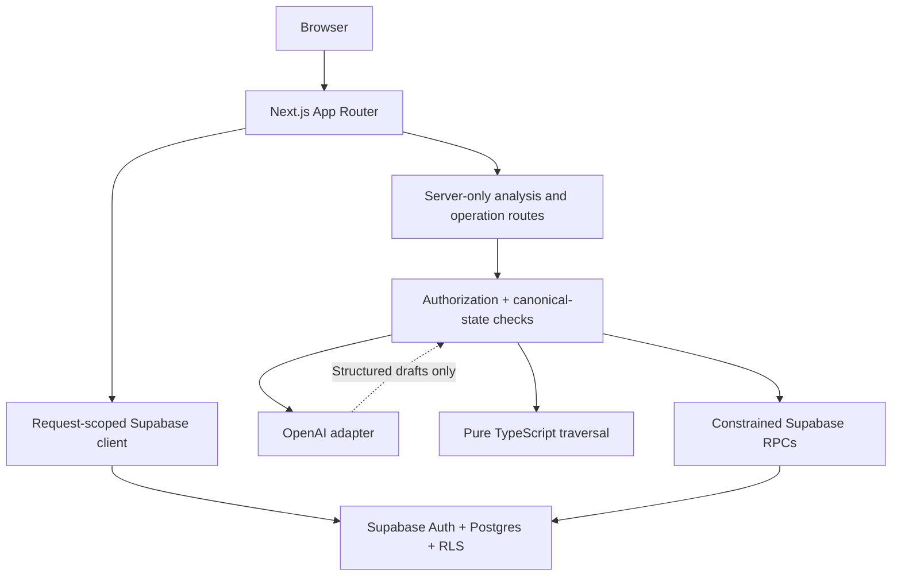

# InOrdo

<div align="center">

**Turn an unstructured project update into evidence-backed impacts and recovery actions—without giving the model permission to change the plan.**

[](https://github.com/Chi944/InOrdo-Hackathon/actions/workflows/ci.yml)


[](LICENSE)

[Open the application](https://inordo.vercel.app) · [Read the architecture](docs/architecture.md) · [Follow the demo](docs/demo-scenario.md) · [Review release evidence](docs/release-evidence.md)

<sub>OpenAI Build Week · Work & Productivity · Built for small teams</sub>

</div>

InOrdo gives a team one reviewable path from new evidence to a safe project response. It preserves the source, uses a bounded server-side model route for interpretation and drafting, computes dependency reach in deterministic TypeScript, and requires an authorized person to approve each internal action. Applied operations are attributable and reversible only when the recorded contract says they are.

> [!IMPORTANT]
> **The canonical deployment is [inordo.vercel.app](https://inordo.vercel.app).** Vercel project `chi944s-projects/inordo` publicly serves reviewed `main` commit [`dad6b33e8fe99ae134f6949a4c46e8311352691d`](https://github.com/Chi944/InOrdo-Hackathon/commit/dad6b33e8fe99ae134f6949a4c46e8311352691d) through production deployment `dpl_EwTWxyQ4j8F7P4Dk3wrh5whTP9RA`. Vercel Authentication remains enabled for Preview deployments only.
>
> The recorded public Production artifact still serves reviewed `main` SHA `dad6b33e8fe99ae134f6949a4c46e8311352691d`. Its original seven-name configuration, Supabase Auth URL, authenticated record/dependency/reset smoke, and contracted mutation RPCs are recorded evidence. One bounded production analysis reached the provider boundary and failed closed with `model_unavailable` because the OpenAI organization had no credits. This repository therefore does **not** claim a successful GPT-5.6 result, proposal apply, or undo. The current branch adds a fail-closed provider policy and judge experience that are not Production evidence until the release plan is completed.

## Product interface

These captures show the implemented product interface from an optimized build. They are not a live-provider response or proof of an authenticated production session.

| Landing and change trace | Responsibility-separated workflow |
| --- | --- |
|  |  |

The protected workspace capture remains a final production-QA deliverable. Synthetic or intercepted test data must never be presented as live GPT-5.6 output.

## Contents

- [Why InOrdo](#why-inordo)
- [How it works](#how-it-works)
- [What is implemented](#what-is-implemented)
- [Quick start](#quick-start)
- [Configuration](#configuration)
- [Local development versus Vercel](#local-development-versus-vercel)
- [Architecture and safety contracts](#architecture-and-safety-contracts)
- [Testing and release](#testing-and-release)
- [Demo scenario](#demo-scenario)
- [Limitations and non-goals](#limitations-and-non-goals)
- [Documentation](#documentation)
- [Contributing](#contributing)
- [Submission handoff](#submission-handoff)
- [License](#license)

## Why InOrdo

A venue change, shifted deadline, or revised decision rarely affects one record. It can invalidate tasks, milestones, risks, and shared artifacts several steps downstream. Small teams often reconstruct that chain manually, under time pressure, with the source fact, inferred impact, and resulting edits scattered across different tools.

InOrdo keeps those responsibilities visible and separate:

**evidence → impact → proposal → approval → history and undo**

- Preserve the raw update before interpreting it.
- Distinguish source fact from model inference.
- Derive downstream reach from explicit, inspectable dependencies.
- Show a full path for every direct or indirect impact.
- Keep drafted actions inert until selective human approval.
- Apply allowed internal changes atomically and record who did what.
- Undo only when the entire operation is supported and still safe to reverse.

## How it works

```mermaid
flowchart LR
    E["Unstructured update"] --> S["Immutable evidence"]
    S --> X["Bounded model extraction"]
    X --> V["Strict schema and evidence validation"]
    V --> G["Deterministic graph traversal"]
    G --> D["Bounded recovery draft"]
    D --> H["Human selective approval"]
    H --> O["Atomic allowlisted operation"]
    O --> A["Actor-attributed history"]
    A --> U["Compensating undo when safe"]

    classDef model fill:#fff7ed,stroke:#c2410c,color:#431407;
    classDef deterministic fill:#eff6ff,stroke:#1d4ed8,color:#172554;
    classDef human fill:#f0fdf4,stroke:#15803d,color:#052e16;
    class X,D model;
    class S,V,G,O,A,U deterministic;
    class H human;
```



The reviewed provider policy supports an exceptional one-use GPT-5.6 recording route, a separately capped Vercel AI Gateway route using the open-weight GPT-OSS model, or a disabled state. A model has no tools, never traverses the graph, never authorizes a user, and never mutates data. Application and database code own canonical state, authorization, reachability, approval, idempotency, transactions, audit history, undo, and reset.

## What is implemented

The P0 repository includes:

- a public landing page, email/password sign-in, and a protected workspace under `/app`;
- native tasks, milestones, decisions, events, risks, and artifacts;
- item, decision, risk, and dependency views, including item detail and editing;
- explicit directed dependencies and deterministic direct/downstream impact paths;
- immutable source intake and a mode-aware, server-only two-stage model boundary;
- persisted proposals with one to eight independently reviewable recovery actions;
- allowlisted, selectively approved internal operations with ordered history;
- compensating undo for eligible whole field-update operations;
- a generation-fenced reset for one named synthetic demo project; and
- unit, component, guarded browser, migration, RLS, and rollback-wrapped SQL verification paths.

This is a Build Week P0, not a production-readiness claim. Live-service and staged-release gaps are listed under [Release status](#release-status) and [Limitations and non-goals](#limitations-and-non-goals).

### Access, input, and provider scope

- **Available evidence input:** typed or pasted project updates, manual notes, meeting minutes, and meeting summaries within the existing text limit.
- **Not implemented:** file upload, CSV import, URL fetching, voice, email, Slack, Teams, Google Drive, and other connectors. The interface exposes no fake upload or connector control.
- **Project scope:** the synthetic summit workspace is available. Ordinary project creation, invitations, switching, and provisioning are not implemented; `/app/projects/ordinary` is an informational preview only.
- **Judge scope:** the dedicated judge account is `viewer` and read-only. It may navigate and inspect saved synthetic records, evidence, paths, proposals, and history, but cannot analyze or mutate data.
- **Fallback scope:** the optional fallback is open-weight GPT-OSS through a dedicated, capped Vercel AI Gateway. A quota can be exhausted and Gateway service is not guaranteed to remain free forever.
- **Billing boundary:** a user's ChatGPT subscription cannot authenticate or fund API calls made by this external application. Provider credentials and billing remain deployment/operator responsibilities.

## Quick start

### Prerequisites

- Node.js **22.x** and npm.
- A Supabase project, or Docker Desktop/a compatible container runtime for local Supabase.
- An operator-created Supabase Auth user mapped to the synthetic workspace for protected-route testing.
- A dedicated provider credential only for an approved live-analysis mode: an exact one-use OpenAI recording grant or a separately capped Gateway fallback. Analysis may remain disabled.

### Install and run

```bash
git clone https://github.com/Chi944/InOrdo-Hackathon.git
cd InOrdo-Hackathon
npm ci
cp .env.example .env.local
npm run dev
```

On Windows PowerShell, use `Copy-Item .env.example .env.local` instead of `cp`. Configure the names described below, restart the development server after changing them, then open [http://localhost:3000](http://localhost:3000).

The public landing page can render without private credentials. Protected data requires valid Supabase configuration and a provisioned account. Analysis is disabled unless the strict server policy selects an authorized provider route; the presence of a credential alone is not authorization. Keep `.env.local` ignored, and never paste its values into commands, issues, screenshots, logs, or commits.

For the complete Windows/macOS setup, least-privilege frontend setup, health checks, and authenticated review steps, use [`docs/local-run-and-test.md`](docs/local-run-and-test.md). Do not casually push a hosted database from the quick-start flow; hosted migrations use the exact approval gates in the [deployment runbook](docs/deployment-runbook.md).

## Configuration

Configuration names belong in local `.env.local` and the appropriate Vercel environment only when that capability is needed. Values never belong in this README.

| Variable | Exposure | Purpose and rules |
| --- | --- | --- |
| `NEXT_PUBLIC_SUPABASE_URL` | Browser-safe | Supabase project URL. Vercel embeds `NEXT_PUBLIC_*` values into the client build. |
| `NEXT_PUBLIC_SUPABASE_ANON_KEY` | Browser-safe | Anonymous key used with the signed-in session and RLS; it is not a service-role credential. |
| `SUPABASE_SERVICE_ROLE_KEY` | Server only | Narrow privileged persistence after request-scoped user authorization. Never import it into a Client Component. |
| `OPENAI_API_KEY` | Recording only, server only | Enables only an approved exact recording grant. Remove it immediately after the recording attempt. |
| `OPENAI_MODEL` | Recording only, server only | Must be exactly `gpt-5.6-luna`; recording never falls back. |
| `DEMO_PROJECT_SLUG` | Server only | Selects the exact checked-in synthetic project for workspace lookup and protected reset. |
| `DEMO_RESET_SECRET` | Server only | Server-held reset guard; it is never supplied by browser code. |
| `ANALYSIS_MODE` | Server only | Exactly `disabled`, `recording`, or `auto`. Absent or invalid values fail closed to disabled. |
| `AI_GATEWAY_API_KEY` | Auto only, server only | Dedicated Gateway key with a nonrenewing hard quota and automatic top-up disabled. |
| `AI_GATEWAY_MODEL` | Auto only, server only | Must be exactly `openai/gpt-oss-20b`. |

Only the two `NEXT_PUBLIC_` variables may enter the browser bundle. Every other configuration name remains server-side. The application validates names and readiness without printing values, and it constructs no provider client until authorization plus the database claim select an exact route.

## Local development versus Vercel

The same Next.js code runs in both places, but the runtime and configuration lifecycle differ.

| Concern | Local | Vercel |
| --- | --- | --- |
| Code lifecycle | `npm run dev` provides hot reload on your machine. | Each deployment is an immutable cloud build. Production changes only after a new deploy/alias assignment. |
| Environment | Next.js reads ignored `.env.local`; restart after changing a variable. | Variables are scoped to Production, Preview, or Development. A change affects only a new deployment. |
| Public values | `NEXT_PUBLIC_*` values are compiled when the local process builds/starts. | `NEXT_PUBLIC_*` values are inlined at build time and frozen into that artifact. |
| Data services | Use the local Docker stack or an explicitly configured hosted Supabase project. | Server functions reach the configured hosted Supabase project over the network. |
| Reachability | Normally machine-only at `localhost:3000`. | Publicly available at [inordo.vercel.app](https://inordo.vercel.app); Preview deployments remain behind Vercel Authentication. |
| Auth | Local callback URLs must be allowed in Supabase Auth. | The canonical domain and approved Preview wildcard must be configured as Auth redirects. |
| Runtime behavior | Long-lived developer process with local logs and resources. | Platform-managed functions, build artifacts, cold starts, request/body/time limits, and provider/network failure modes. |
| Verification | Best for fast unit, UI, and local database iteration. | Required for domain, cookie, redirect, environment-scope, hosted RLS/RPC, and production smoke evidence. |

The Vercel project uses Node.js 22.x and is deployed manually; it is not connected to automatic Git deployments. See [`docs/deployment-runbook.md`](docs/deployment-runbook.md) before changing Production configuration or deploying.

## Architecture and safety contracts

### Technology

| Layer | Technology |
| --- | --- |
| Web | Next.js 16 App Router, React 19, TypeScript, React Server Components |
| Interface | Tailwind CSS 4, Lucide icons |
| Data and identity | Supabase Postgres, Auth, RLS, Supabase JS/SSR |
| Model boundary | One-use GPT-5.6 recording or capped Vercel AI Gateway GPT-OSS, OpenAI SDK-compatible server adapters |
| Validation | Zod plus canonical-state postvalidation |
| Quality | Vitest, Testing Library, Playwright, ESLint, TypeScript, SQL assertion suites |
| Toolchain | Node.js 22, npm |



Browser code receives only the public Supabase URL and anonymous key. Normal product reads use a request-scoped user client under RLS; the service-role client is not a general read path. OpenAI calls and privileged persistence live in server-only modules. RLS and database constraints remain the source of truth; hiding a control in the UI is never treated as authorization.

### Analysis boundary

The server performs two bounded logical model calls:

1. **Extraction** returns either no candidate or one structured candidate change from the source and a bounded canonical snapshot.
2. **Recovery drafting** receives the validated change plus application-computed impact paths and returns **one to eight** inert recovery actions and annotations.

Both calls use strict Zod-backed structured output, canonical-state postvalidation, evidence-span checks, no tools, `store: false`, a 30-second timeout per call, and no automatic retries. IDs, fields, values, versions, dates, owners, and impact coverage are checked before derived data can persist. OpenAI is never called from a Client Component.

`recording` mode routes only an exact owner-issued, one-use actor/project/source grant to `gpt-5.6-luna`. `auto` mode routes only to `openai/gpt-oss-20b` through a dedicated capped Gateway key and never consumes the OpenAI recording key. `disabled`, invalid configuration, viewer access, exhausted quota, duplicates, and unauthorized requests create no provider call. A provider failure may preserve immutable evidence plus a failed claim, but it creates no proposal or project mutation.

An analysis claim has a fixed, nonrenewable three-minute lease. An active exact duplicate returns `202` with `Retry-After`; replay after expiry terminalizes the same claim instead of spending on a second model attempt. Idempotent completion accepts one owner of the claim, and late provider results plus their derived writes are rejected atomically.

### Deterministic dependency graph

Dependency direction follows the database contract:

- `from_item_id` is the **dependent** item;
- `to_item_id` is its **upstream prerequisite or context**; and
- when an upstream item changes, traversal follows reverse adjacency to find what it affects.

Pure TypeScript breadth-first traversal considers active records only, terminates cycles and self-loops defensively, deduplicates edges and affected records, and returns stable direct/indirect paths. A best-depth map preserves the deterministic shortest/best path. Default maximum depth is **5** and the validated maximum is **20**. The graph function makes no network or model call.

### Approval, history, and undo

- A proposal is not permission. Only an authorized owner/admin can select specific action IDs and confirm the operation.
- Only an eligible, fully linked proposal can move from `draft` to `ready` on the server. That transition approves nothing: actions remain pending, and the UI fails closed in every other state.
- The mutation vocabulary is allowlisted: field update, constrained task creation, constrained risk creation, and confirmation activity.
- Authorization, proposal readiness, action state, expected item versions, human responses, payload bounds, and idempotency are rechecked server-side.
- Set-level validation rejects duplicate target-field updates and incompatible same-item dates; create-item audit receipts are rebuilt from the committed row rather than caller or model JSON.
- Selected actions, record changes, proposal transitions, and ordered before/after audit entries commit in one transaction or none do.
- History is actor-attributed and append-only.
- Undo is available only for an **entire** operation made solely of reversible field updates, and only while current state still matches every recorded after-state.
- Undo creates a linked compensating operation. It never edits or erases the original history.

### Demo reset

Reset is restricted to an owner/admin, the exact configured synthetic project, and a server-held guard. It restores the checked-in baseline of **24 active records and 26 edges**, retires nonbaseline records, advances the project workflow generation to fence stale requests, and preserves prior evidence and operation history as archived history. It is not a general workspace-delete endpoint.

### Native record mutation rollout

Native create/update item and create/remove dependency writes use four authorized, generation-fenced, idempotent RPCs. Migration `20260719140000_guard_project_record_mutations` was the **expand** phase: it added the private receipt ledger and RPCs while temporarily retaining legacy contributor DML. After the exact RPC artifact passed hosted create, update, dependency-add, dependency-remove, replay, and reset smoke tests, reviewed PR [#17](https://github.com/Chi944/InOrdo-Hackathon/pull/17) merged and the separately approved `20260720190000` **contract** migration was applied by itself.

The linked ledger now has exact parity through `20260720190000`. The contract verifier proves legacy table and column write grants/policies are absent, member reads remain, direct DML is denied, all four RPCs succeed, exact retry deduplicates, and true nonmembers are rejected. Because the contract is forward-only, a pre-RPC deployment is no longer a valid rollback target. The authoritative containment and forward-recovery rules are in the [deployment runbook](docs/deployment-runbook.md) and [rollback plan](docs/rollback-plan.md).

### Repository map

```text
.
├── src/
│   ├── app/                     # Landing, login, protected workspace, API routes
│   ├── features/
│   │   ├── analysis/            # Intake, model adapter, validation, orchestration
│   │   ├── impact/              # Pure deterministic graph traversal
│   │   ├── operations/          # Apply, history, undo, reset
│   │   └── project-records/     # Typed item/dependency operations
│   ├── lib/                     # Auth, environment, repositories, Supabase clients
│   └── types/                   # Generated database types
├── supabase/
│   ├── migrations/              # Forward-only schema and contract migrations
│   ├── tests/                   # Rollback-wrapped SQL assertions
│   └── seed.sql                 # Credential-free fictional summit fixture
├── docs/                        # Product, architecture, QA, release, submission
└── .github/                     # CI and contribution templates
```

## Testing and release

### Commands

| Command | Purpose |
| --- | --- |
| `npm run dev` | Start the local development server. |
| `npm run lint` | Run ESLint. |
| `npm run typecheck` | Check TypeScript without emitting files. |
| `npm run test` | Run Vitest in watch mode. |
| `npm run test:run` | Run unit and component tests once. |
| `npm run test:e2e` | Run the guarded Chromium journey; provider/database seams are intercepted, so this is not live-service evidence. |
| `npm run build` | Create the optimized production build. |
| `npm run start` | Serve the optimized build. |
| `git diff --check` | Detect whitespace errors in the patch. |

Before committing, run:

```bash
npm run lint
npm run typecheck
npm run test:run
npm run build
git diff --check
```

Local Supabase verification starts with `npx --no-install supabase start` and may use `npx --no-install supabase db reset` to replay migrations and `supabase/seed.sql`. **`db reset` is destructive**: run it only against the local or an explicitly disposable demo database. Linked hosted migrations, rollback-wrapped SQL suites, security checks, and release approval are documented separately; do not infer them from an application build.

### Release status

| Area | Current evidence | Still required |
| --- | --- | --- |
| Application | Node 22 lint, typecheck, 400 unit/component tests across 58 files, two Chromium journeys, production build, audit, and whitespace checks passed; PRs #19 and #20 independently passed CI before merge. | Keep future changes behind their own review and gates. |
| Database | Hosted migrations align through contract tail `20260720190000`; linked type parity, migration parity, error-level lint, direct-DML denial, four guarded RPCs, replay, member reads, and nonmember rejection passed. | Re-run the contract verifier after any future privilege or mutation-RPC change. |
| OpenAI | All server configuration is present; one production request failed closed during extraction with safe `model_unavailable` metadata. | Fund the OpenAI API organization, then run exactly one synthetic retry and complete proposal/apply/history/undo evidence. |
| Browser | Authenticated production native-mutation/reset smoke passed; local layouts passed at 375, 768, and 1440 pixels; the deployed skip link passed keyboard focus verification. | Complete a fresh login/session/logout matrix and the funded analysis-to-undo path. |
| Deployment | Production `dpl_EwTWxyQ4j8F7P4Dk3wrh5whTP9RA` is `READY` at public [inordo.vercel.app](https://inordo.vercel.app), serves SHA `dad6b33e...`, and has all seven Production names. Preview remains protected. | Verify the final video, Devpost, and demo-access links signed out before submission. |

Vercel deployment is manual—there is no Git-connected automatic deploy. Production must use Node.js 22.x, a clean reviewed `main` equal to `origin/main`, correctly scoped environment names, and the canonical alias. Environment changes require redeployment. Supabase Auth allows the canonical production origin, documented local redirects, and the approved account-scoped Preview wildcard. Deston confirmed on July 20, 2026 that the current Vercel Hobby terms permit this hackathon demo; that project-owner confirmation is recorded as operational evidence, not legal advice.

Never treat `db push --dry-run` as mutation authorization, never deploy a feature branch as Production, never expose a server secret to Preview/client code, and never describe a build/test seam as live provider or RLS evidence. Use:

- [QA checklist](docs/qa-checklist.md) for exact completed and pending evidence;
- [release evidence](docs/release-evidence.md) for commit/deployment identity;
- [deployment runbook](docs/deployment-runbook.md) for environment, migration, deploy, smoke, and rollback commands;
- [security review](docs/security-review.md) for the threat checklist; and
- [rollback plan](docs/rollback-plan.md) for forward-only database and application containment.

## Demo scenario

The fixture is the fictional **Civic Futures Lab — Regional Climate Action Summit 2026**: eight fictional team members, 24 active project records, and 26 explicit dependencies. No customer data or credential is included.

The demo source moves the summit from **12 September 2026** to **26 September 2026** because the venue is unavailable. The intended review path is:

1. sign in with an operator-provisioned email/password account and open `/app`;
2. paste the exact venue update and preserve it as evidence;
3. compare the source with the structured candidate change;
4. inspect deterministic direct and indirect paths, including event → speaker confirmation → programme lock → briefing pack;
5. review one to eight recovery actions and leave any cost-sensitive travel decision unselected;
6. confirm only the chosen actions, then inspect actor-attributed history; and
7. undo an eligible whole field-update operation or run the protected named-demo reset.

The protected workspace also exposes `/app/projects`, `/app/items`, item detail, `/app/decisions`, `/app/risks`, and `/app/dependencies`. Follow the exact source, expected path, presenter notes, and stop conditions in [`docs/demo-scenario.md`](docs/demo-scenario.md). Ordinary-project provisioning is not implemented; its route is informational. Account provisioning stays out of source control and is described in [`docs/demo-user-setup.md`](docs/demo-user-setup.md).

## Limitations and non-goals

| Limitation | Practical effect |
| --- | --- |
| The OpenAI organization is unfunded. | The key and server path are configured, but the single production attempt failed closed; no successful GPT-5.6 result may be claimed yet. |
| GPT-OSS fallback has a real cost boundary. | It uses a dedicated capped Vercel AI Gateway key; the quota may be exhausted and service is not guaranteed to remain free forever. |
| Ordinary workspaces are informational only. | Project creation, invitations, switching, and provisioning are not implemented in this Build Week release. |
| Judge access is intentionally read-only. | The viewer may inspect the synthetic workspace but cannot analyze, create, edit, apply, undo, reset, remove, or delete. |
| Evidence input is text-only. | Typed/pasted updates, manual notes, meeting minutes, and summaries are available; files, CSV, URLs, voice, email, and connectors are not. |
| Authenticated production QA is partial. | Native records, dependencies, rollback, and reset are proven; the funded analysis, proposal apply, history, and undo journey is not. |
| Supabase leaked-password screening is unavailable on the current Free plan. | Keep the synthetic demo password unique, generated, out of source control, and rotate it if exposure is suspected. |
| Undo is intentionally narrow. | Only an entirely reversible field-update operation with matching current after-state can be compensated. |
| Analysis finalization takes whole-table `SHARE` locks on item/dependency tables. | Other-project writes may wait; P0 is bounded to a low-volume synthetic demo pending project-scoped coordination. |
| Dependency management loads at most 500 edges without a truncation indicator. | The 26-edge fixture is complete; larger projects must not treat the screen as a complete inventory. |
| Preview protection and operator-held credentials constrain authenticated QA. | Public Production access is available, while login credentials and provider spend remain explicit human responsibilities. |

Outside P0:

- external connectors and synchronization engines;
- embeddings, vector search, RAG, or semantic search infrastructure;
- autonomous model-driven mutation;
- enterprise administration and production-scale observability;
- native mobile applications; and
- alternate backends, graph databases, or workflow orchestrators.

The current priorities and scale follow-ups live in [`docs/backlog.md`](docs/backlog.md).

## Documentation

| Document | Use it for |
| --- | --- |
| [Product brief](docs/product-brief.md) | Purpose, P0 scope, actors, and acceptance principles. |
| [Architecture](docs/architecture.md) | Trust boundaries, schemas, graph semantics, model/data contracts, and invariants. |
| [Local run and test](docs/local-run-and-test.md) | Safe environment setup, local/hosted modes, and role-specific verification. |
| [Demo user setup](docs/demo-user-setup.md) | Provisioning separated owner/operator/judge Auth identities without committing credentials. |
| [Devpost judge handoff](docs/devpost-handoff.md) | Read-only test path, mutually exclusive result copy, private credential rules, and account retirement. |
| [Demo scenario](docs/demo-scenario.md) | Fictional source, expected paths, presenter flow, and stop conditions. |
| [Security review](docs/security-review.md) | Threat checklist, completed evidence, and remaining live checks. |
| [QA checklist](docs/qa-checklist.md) | Automated, SQL, browser, accessibility, and production gates. |
| [Release evidence](docs/release-evidence.md) | Exact commit/deployment status and evidence matrix. |
| [Deployment runbook](docs/deployment-runbook.md) | Manual Vercel/Supabase release, exact approvals, smoke, and recovery. |
| [Rollback plan](docs/rollback-plan.md) | Containment, compatible artifacts, forward migrations, and domain compensation. |
| [Backlog](docs/backlog.md) | P0 closure, roadmap, and scaling debt. |
| [Codex log](docs/codex-log.md) | Public work-package summaries without private transcripts. |
| [Submission copy](docs/submission-copy.md) · [video script](docs/video-script.md) · [submission checklist](docs/submission-checklist.md) | Final Build Week packaging and human handoff. |

## Contributing

Read [`AGENTS.md`](AGENTS.md) before making changes. It defines Deston/Andres ownership, architecture boundaries, secret handling, required checks, branch naming, and the non-negotiable rule that model output never directly mutates data.

Use short-lived `deston/`, `andres/`, or `codex/` branches as appropriate, keep commits focused and conventional, preserve unrelated work, and never force-push a shared branch. Pull requests should state user-visible behavior, trust-boundary changes, tests run, and remaining human gates.

### How Codex accelerated the build

Codex supported scoped implementation and review across the repository foundation, schema/RLS, deterministic graph engine, strict GPT contracts, operation/undo/reset boundaries, accessibility-focused UI, automated checks, and release documentation. Human owners retained product decisions, credentials, approvals, provider spend, and deployment authority. Public work-package summaries are in [`docs/codex-log.md`](docs/codex-log.md); no private transcript is committed.

## Submission handoff

| Item | Public value or required action |
| --- | --- |
| Track | OpenAI Build Week — **Work & Productivity** |
| Repository | [github.com/Chi944/InOrdo-Hackathon](https://github.com/Chi944/InOrdo-Hackathon) |
| Production application | [inordo.vercel.app](https://inordo.vercel.app) — public deployment `dpl_EwTWxyQ4j8F7P4Dk3wrh5whTP9RA`, SHA `dad6b33e8fe99ae134f6949a4c46e8311352691d`; Preview deployments remain protected |
| Demo access | Follow the non-secret [judge handoff](docs/devpost-handoff.md); enter the actual viewer credential only in Devpost's private fields and never commit a password. |
| Public video | `<PUBLIC_YOUTUBE_VIDEO_URL>` |
| Devpost entry | `<DEVPOST_URL>` |
| Team | `<TEAM_MEMBER_NAMES_AND_ROLES>` |
| Primary Codex feedback Session ID | `<PRIMARY_FEEDBACK_SESSION_ID>` — run `/feedback`; never fabricate an ID or publish a private transcript |
| Deadline | July 21, 2026 at 5:00 PM PDT / July 22, 2026 at 8:00 AM SGT, subject to final confirmation against the [official schedule](https://openai.devpost.com/details/dates) |

Before submission, replace every angle-bracket placeholder, verify all public links signed out, reconcile claims with the exact submitted Git and Vercel artifacts, finish the operator-held live gates, and lock the repository/deployment after the deadline as required. The full owner-by-owner checklist is [`docs/submission-checklist.md`](docs/submission-checklist.md).

## License

InOrdo is available under the [MIT License](LICENSE), currently attributed to the **InOrdo Hackathon Team**.

> **TODO before submission:** verify the temporary copyright holder and legal attribution with every team member.
